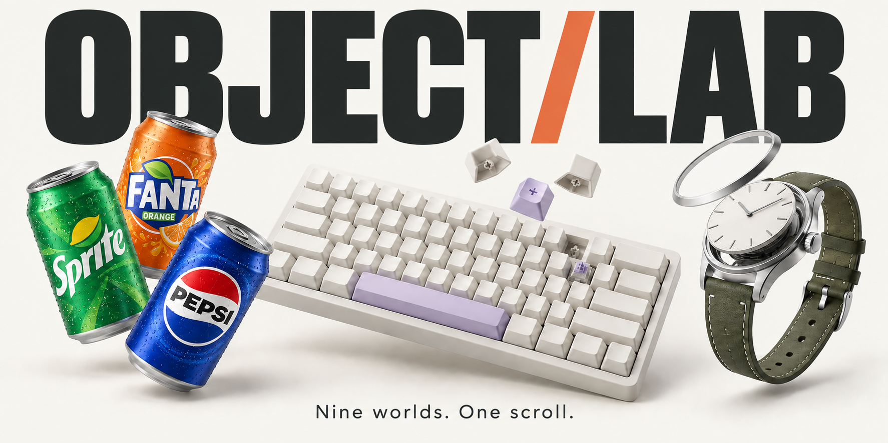

# Object Lab

[](https://object-lab-3d.netlify.app/)

Nine scroll-driven 3D stories, one homepage, and a separate folder for every experiment.

**Gallery:** https://object-lab-3d.netlify.app

**Repository:** https://github.com/SafaElmali/interactive-3d-lab

## In motion

A 19-second film made with Remotion. 1080p, with music—sound on.

https://github.com/user-attachments/assets/6a9d6dc7-f9e9-49a1-be1b-bd724a4503b0

## Run locally

Requires Node.js 22 or newer. No dependency installation is necessary: the pinned Three.js library, fonts, models, and textures are included locally.

```sh
npm run dev
```

Open http://127.0.0.1:4320/. Each project is also directly accessible at `/projects/<folder>/`.

```sh
npm run check  # Syntax, links, GLB integrity, geometry, scroll poses, and reverse-scroll checks
npm run build  # Copies the deployable site into dist/
```

## Projects

| Folder                         | Experience    | Scroll sequence                                                        |
| ------------------------------ | ------------- | ---------------------------------------------------------------------- |
| `projects/can-do/`             | CAN/DO        | Original lineup, featured can, back label, regroup                     |
| `projects/sneaker-studio/`     | Sole Studio   | Floating colorways, airborne spin, outsole reveal, reunion             |
| `projects/keyboard-builder/`   | Key / Form    | Key wave, exploded layers, scattered caps, reassembly                  |
| `projects/perfume-collection/` | Essence       | Suspended bottle, lifting cap, drifting mist, fragrance trio           |
| `projects/vinyl-room/`         | Side A        | Turntable, needle drop, levitating record, orbiting discs              |
| `projects/watch-explorer/`     | Second Nature | Watch portrait, exploded case, turning cogs, reassembly                |
| `projects/miniature-city/`     | Small Hours   | Floating buildings, golden hour, illuminated night, flyover            |
| `projects/car-garage/`         | After Hours   | Night portrait, paint and angle changes, moving light gates, final lap |
| `projects/coffee-journey/`     | Daily Ritual  | Bean cloud, grinder, pouring coffee, steaming cup                      |

## Surface quality

The shared renderer uses a local HDR studio environment, directed lighting, shadows between parts, and antialiased rendering up to 2× device resolution. Custom objects use beveled edges and smooth profiles. The turntable, watch, and buildings use photographic normal and roughness maps; glass and metal use physical materials. The car is the detailed Khronos CarConcept asset, with separate paint, glass, tire, and interior materials. Geometry and textures are reused across repeated parts.

All models, maps, and HDR files are served locally. Asset provenance is in `CREDITS.md`, `assets/sources.json`, and `assets/materials/sources.json`. CAN/DO retains its standalone rendering and motion.

## Structure

```text
index.html / home.js / styles.css   Gallery with live 3D previews
projects/<project>/                Standalone entry point, scene.js, and story.js
shared/                            Scroll renderer, choreography helpers, geometry, registry
vendor/                            Pinned Three.js 0.179.1 and addons
assets/                            Shared fonts and source metadata
scripts/                           Development server, checks, static build
.openai/hosting.json                Private Sites hosting configuration
```

Each `scene.js` provides the shared 3D model for the gallery and the full experience. Each of the eight new `story.js` files owns its art direction, four chapter texts, palette, and scroll choreography. `shared/story.js` handles rendering, native document scrolling, text transitions, loading, and navigation. `shared/choreography.js` contains deterministic interpolation helpers. CAN/DO retains its original independent implementation.

## Motion and accessibility

- Scroll using a wheel, trackpad, touch, or the browser’s standard keyboard controls. The canvas never captures scrolling or dragging.
- There are no customization panels. Scene motion, color changes, exploded views, and transitions follow scroll position and work in reverse.
- Reduced motion presents static chapter compositions without spins, parallax, or time-driven movement.
- Rendering pauses in hidden tabs and resumes after browser history restoration.
- Each final chapter links to the next project; the collection and source credits remain available throughout.
- Models, textures, and fonts are local. No third-party asset requests or autoplay audio are needed.
- The automated checks use real geometry with image-loading stubs. They verify 122 forward scroll poses per story across desktop and mobile camera proportions, reverse-scroll determinism, reduced-motion chapter states, and local routes. They do not render pixels or test GPU shaders. Browser visual QA has not been performed.

## Deploy to Netlify

The Netlify project is `object-lab-3d`. Build settings are in `netlify.toml`; `dist/` contains only the public site. The current project uses manual deployments:

```sh
npm run check && npm run build
netlify deploy --prod --dir dist
```

See [CREDITS.md](CREDITS.md) for original assets, modifications, and licenses. The watch movement, city, and coffee stages are illustrative models.
